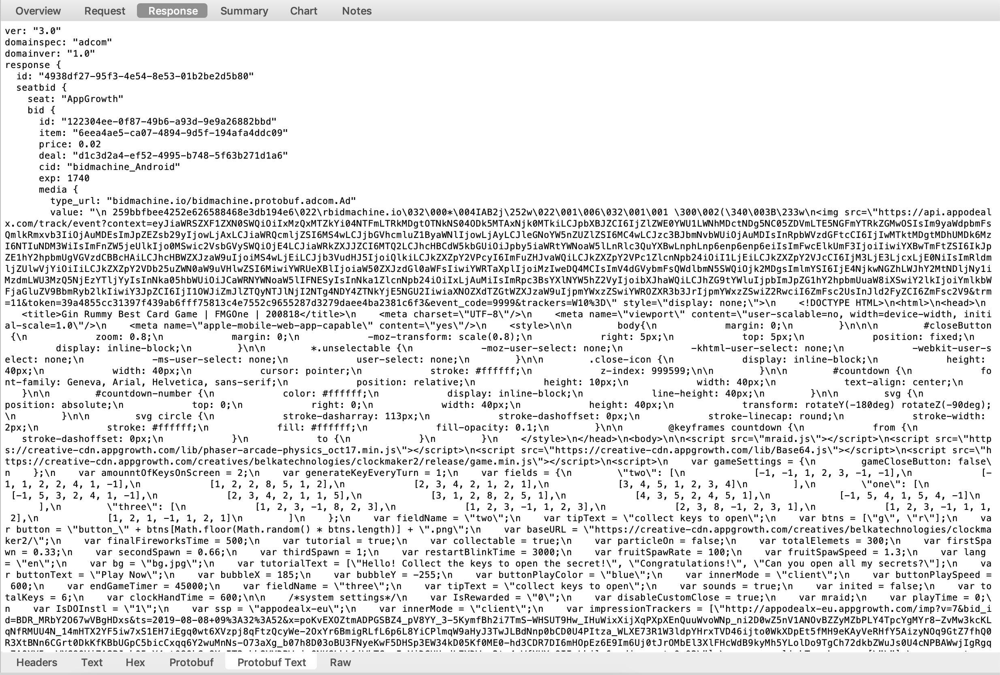
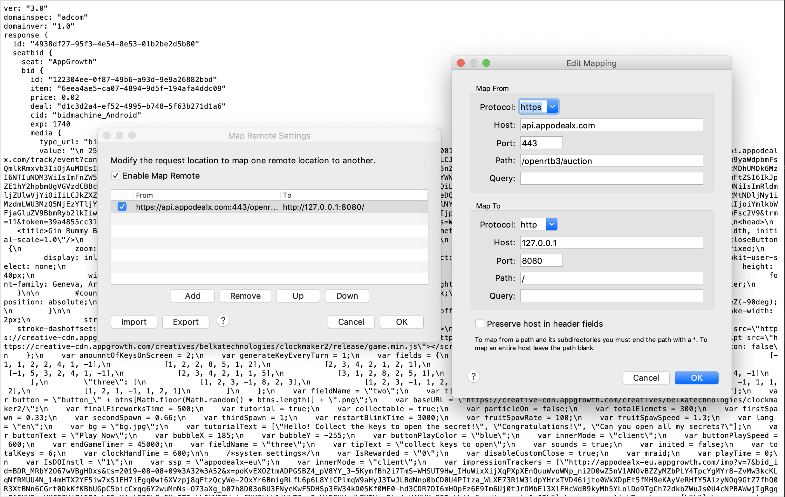

# Simple protobuf mock server

1.Save real response body from Charles



2.Turn on **Map Remote** tool in Charles



3.Start local server

```java -jar mock.jar -m <Protobuf message full type name> -f <file> -d <Descriptor file 1> .. <Descriptor file N>```

Example:

``` java -jar ./out/artifacts/mock_jar/mock.jar -m bidmachine.protobuf.openrtb.Openrtb -f bidmachine.protobuf.openrtb.Openrtb_charles.json -d bidmachine.desc google.desc```
